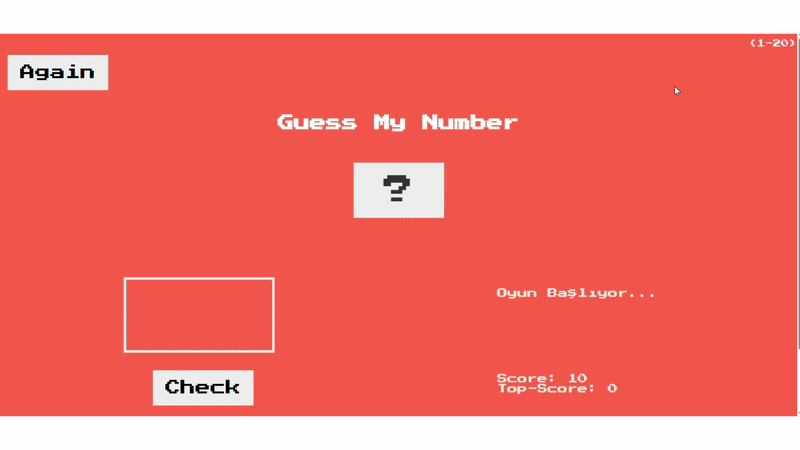
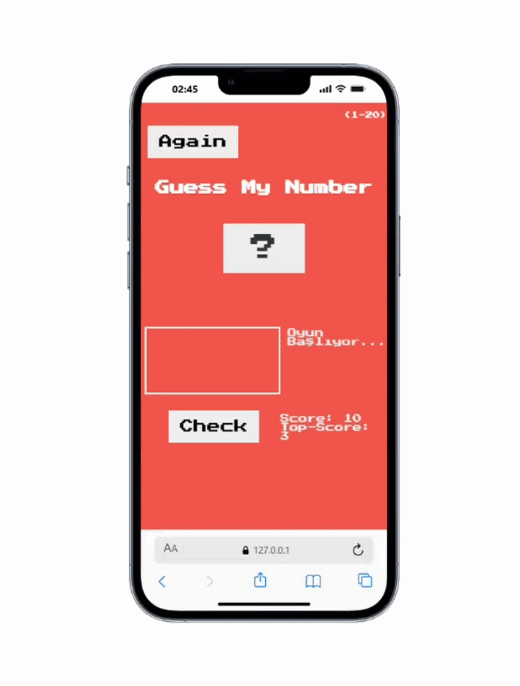

# Guess Number

A completed number guessing game where the player tries to find the correct number using on-screen hints.

## 🌐 Demo
https://nursaadet.github.io/Guess-Number/

## 🎥 Example Outcome

### Desktop View

### Mobile View

## ✨ Features
- Prevents entering duplicate numbers
- Restricts input to numbers between 1–25
- Blocks text input
- Displays top-score indicator
- Uses DOM manipulation
- Saves data with Local Storage
- Restart game with “Again” button
- Visual feedback:
  - Green for win
  - Red for lose

## 🛠 Tech Stack
- HTML
- CSS
- JavaScript
- Local Storage

